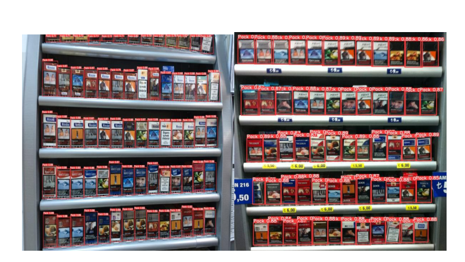

# Product Recognition System

## Overview
This project addresses the challenges associated with product recognition through a two-stage pipeline. The proposed solution involves class-agnostic object detection in the first stage, followed by product recognition in the second stage using a K-NN similarity search. The process is designed to efficiently identify individual product items within an image.

## Proposed Approach

### 1. Detection
The first stage, detection, aims to obtain bounding boxes that accurately localize products in an image, providing a confidence score for each detection. To achieve this, a CNN-based object detector (Detector) is employed. The detector is trained on a large collection of annotated images, focusing on common product features shared across multiple items. This enables product-agnostic detection, making the detector versatile across various stores and products without the need for frequent retraining.

## 2. Recognition
One way to obtain a high-quality global image descriptor is by using a pretrained CNN. This concept is expanded by training another CNN, referred to as an embedder, to learn a function E: I → D that transforms an input image i ∈ I into a k-dimensional descriptor d k ∈ D that can be recognized through K-NN search. To train this embedder, triplets of different images are sampled, consisting of an anchor (ia), a positive (ip), and a negative (in). The anchor and positive images share the same class, while the negative image belongs to a different class. A distance function d(X,Y) is used in the descriptor space, where X,Y ∈ D represent the descriptors computed by the embedder for images i. The network is trained using a triplet 
ranking loss.
 L = max(0, d(E(ia), E(ip)) − d(E(ia), E(in)) + α)

the triplet ranking loss includes a fixed margin α that must be enforced between the pair of distances. The network is trained by minimizing this loss, which results in the encoding of images representing objects from the same class being positioned adjacent to each other in D, while ensuring that objects from different classes are well-separated. To create the necessary triplet, two products are randomly chosen at each training iteration, and their reference images are used as the positive (ip) and negative (in) images. Then, a new anchor image (ia) is synthesized from the positive image (ip) using a suitable data augmentation function A: I → I to make it more similar to query images. The Embedder network is used to create a reference database of descriptors that are associated with the products to be recognized. This involves generating a global descriptor (E(ir)) for each reference image (ir) available. The same embedding process is used to obtain E(ipq) for each candidate region (ipq) that is cropped from the query image (iq). To differentiate between the initial KNN of E(ipq) and the reference database, the distance between each E(ipq) and E(ir) is calculated in the embedding space. This distance is represented as d(E(ipq), E(ir)).

#### 2.1 Siamese Network
As an alternative to conventional CNNs, the project explores the use of Siamese Networks for product recognition. Siamese Networks consist of duplicate subnetworks, learning a similarity function that allows them to estimate the similarity of inputs without requiring retraining for adding or removing classes. Key features and benefits of Siamese Networks include:

- **Identical Subnetworks:** Siamese Networks consist of two or more subnetworks that are identical in configuration, parameters, and weights. Typically, only one subnetwork is trained while the others maintain the same configuration.

- **Handling Class Imbalance:** Siamese Networks are effective in handling class imbalance, making them suitable for scenarios where acquiring a significant amount of data is impractical.

- **Classifier Ensembling:** The networks are compatible with classifier ensembling, providing flexibility in the overall recognition system.

- **Semantic Similarity:** Siamese Networks excel in acquiring knowledge on semantic similarity, making them valuable for tasks like product recognition.

However, it's important to note that Siamese Networks demand more training time compared to conventional networks due to the quadratic pairs they learn from. Additionally, instead of probabilities, they output the distance from each class.

### 3. Image Embedding
In one approach, each region proposal generated by the Detector is cropped from the input image and fed into a CNN (Embedder) to generate a unique image representation. This representation is utilized for product recognition by performing a K-NN similarity search within a precomputed reference database of representations.

## Experimental Results

### 4 Datasets and Evaluation Metrics
In our experimental evaluation, we utilized a publicly available dataset containing shelf and product images. This dataset consists of approximately 10 classes of grocery products that are arranged in hierarchical classes. Each product is represented by a single reference image. The dataset contains an average of 200 products per class, and the remaining 10,000 products are not categorized and can be considered as the negative class.

### Implementation Details - Detection
For the detection stage, we employed a one-stage object detector called Yolov3. We chose this network for its real-time performance on GPUs and the availability of the original implementation. We used the recommended hyperparameters and provided weights to train the network on 243 images and validated it on 111 images for 20 epochs. Below are sample output images with bounding boxes generated by Yolov3.

## Result from Siamese Network
Add information on the results obtained from the Siamese Network here.

